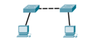
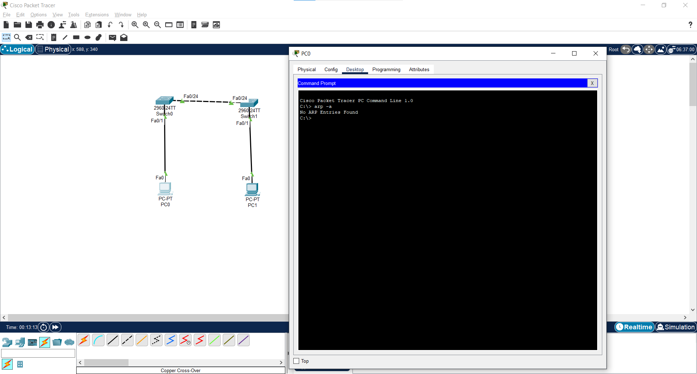
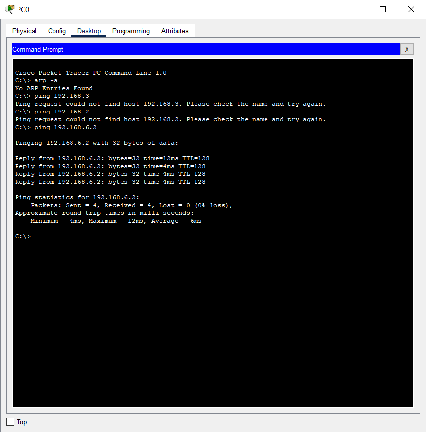

## Information Networks_Pramoda Medis
 
Pramoda Medis, PramoGIT, pramoda.medis@student.hamk.fi

## Exercise 06

The goal of the exercise is to get familiar with the operation of the ARP protocol, the use of mac
addresses, as well as the MAC address table of the switch. RETURN to Moodle your answers to
the questions presented, as well as the PC's ARP and switch MAC address table.

    1.	Find out your computer's MAC address

    2.	Check out your computer's ARP table (arp-a)

    3.	Find out what the gateway address of your computer is

    4. Open the Packet Tracer program and build the network shown in the illustration.

• Connect computers to ports F0/1 and connect switches to each other from ports F0/24.
You can use the 2960 series switches.

    5. Name the switches S1 and S2

    6. Assign IP addresses to computers. Use the 192.168.6.0 /24 network

    7. Check out the ARP table on both computers. What addresses appear on the table?

    8. Ping to test the connection between computers and check the ARP table again. Has
anything changed?

    9. Find out what the switch arp table looks like (Switch#show arp )

• What you should to do that it's possible to see arp-table on the switch?
• Why arp table of the switch is empty?

    10. Check the contents of the switch's mac address table
• If mac address table is empty, you should ping between computers again

    11. What's the difference between arp and mac address tables?

### Answer

Both ARP (Address Resolution Protocol) tables and MAC address tables are used in networking to map addresses, but they serve different purposes and exist on different devices.
ARP tables help devices find each other, while MAC address tables help switches deliver data efficiently.

    Find below Screenshots for the packet tracer activity

