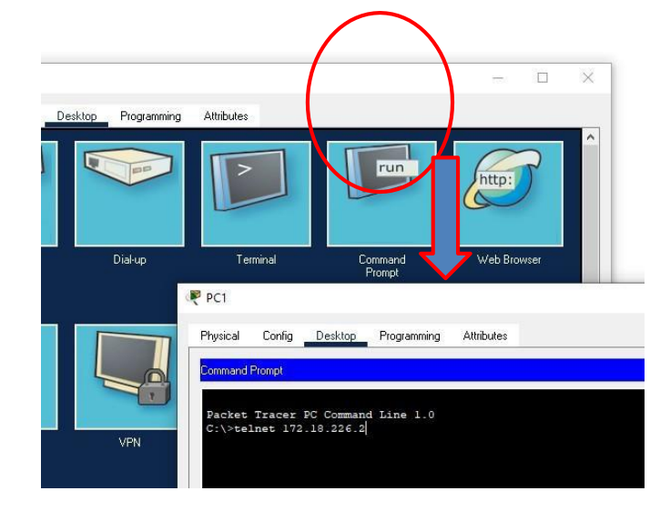

# Information Networks_Pramoda Medis
 
Pramoda Medis, PramoGIT, pramoda.medis@student.hamk.fi

# Exercise 03

## GETTING TO KNOW THE CISCO-IOS INTERFACE

OBJECTIVES

The aim of the work is to familiarize yourself with the Cisco user interface (IOS) and the basic configuration 
of the switch using the Packet Tracer program.

1. In Packet Tracer, choose the Cisco 2960 switch, select the CLI tab, and learn how the user interface works.

2. Familiarize yourself with the switch interface by figuring out the meaning of the following commands. (Note that you can always type a question mark, e.g. show?, after a command, so that the command is not executed, but you can see what 
kind of additional commands can be entered.)

• Find out how to navigate the different command modes of the router (user, priviledge, global configuration and 
specific configuration)

• Try shortening commands e.g. ena instead of enable, etc.

• Try completing commands with the tab key

3. Make sure you're in priviledge mode (use enable to access priviledge mode) and find out what the following commands mean.

• show running-config

• show startup-config

• show version

• show flash

• show ip interface brief

4. Define a suitable "host name" for your switch

5. Define console password and privilege-mode password. Test that they work as intended.

6. Save your settings to the "permanent memory" of the switch. Use copy running-config startup-config commands. Also command write could be use. How to find out if a configuration is saved?

7. Build the network as shown in the picture below.

8. Assign the computer an IP address of 172.18.226.0/24 from the network. (/24 means a mask where the first 24 bits are set to one. The mask is therefore 255.255.255.0)

9. Test your computer-to-computer connection by pinging or using the envelope tool

10. Assign each switch its own IP address from that previously used network. As you saw earlier, the switch forwards computer-to-computer traffic even if it doesn't have an IP address. The importance 
of the IP address on the switch is only related to network management.

11. Test the operation by pinging from computer to switches and from switches to switches, etc.

12. Enable telnet management of switches by specifying telnet passwords.

13. To ensure that telnet management works from computer to switch, open a telnet connection from the computer to the switch (shown below).

14. Save your configuration to the startup-configuration file

15. Find out how to save configuration file data to a PC. At the last return your configuration file to the Learn.

## Find the attached screenshots for the given task:

